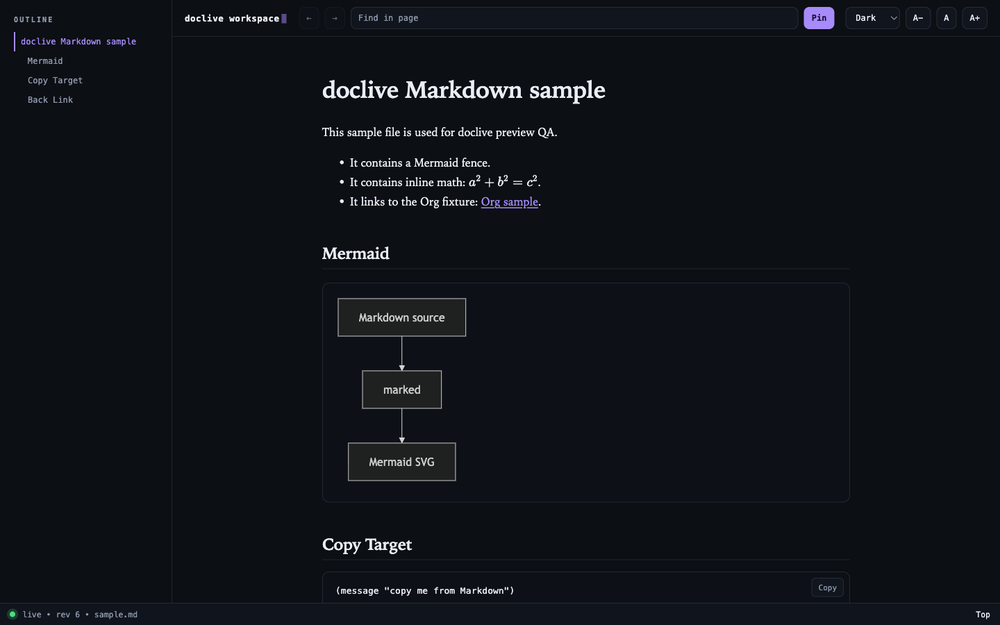
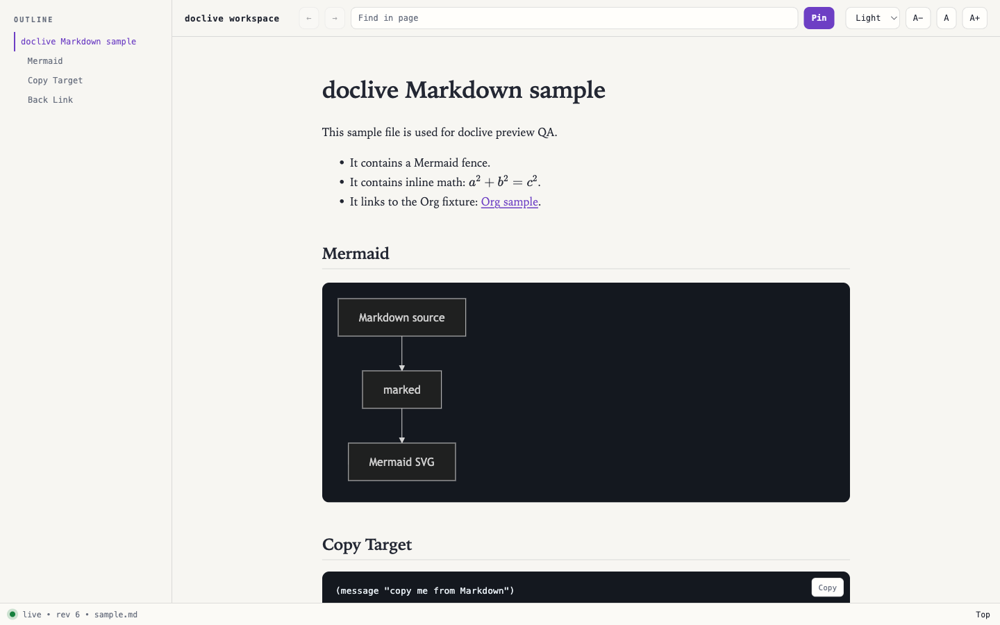

#+TITLE: doclive

[[https://github.com/takeokunn/doclive/actions/workflows/ci.yml][https://github.com/takeokunn/doclive/actions/workflows/ci.yml/badge.svg]]
[[https://www.gnu.org/licenses/gpl-3.0][https://img.shields.io/badge/License-GPL_v3+-blue.svg]]
[[https://www.gnu.org/software/emacs/][https://img.shields.io/badge/Emacs-29.1+-7F5AB6.svg]]

English version: [[file:README.org][README.org]]

* Overview

doclive は、Markdown / Org を Emacs の xwidget WebKit で可視化するライブプレビュー用 Elisp パッケージです。
SSE で更新を配信し、Emacs 内で扱いやすいようにリアルタイム同期します。
AI が生成した Mermaid 図や LaTeX 数式（equation, align, gather, cases など）を追加設定なしで表示できます。

Light テーマ:

* Features

- SSE によるライブ更新（150ms デバウンス付き）
- xwidget WebKit による Emacs 内プレビュー。文書バッファの隣に別ウィンドウで開き（配置は変更可能）、
  同じバッファで =doclive-preview-buffer= を再実行すると既存のプレビューバッファを使い回します（未対応 Emacs では外部ブラウザへフォールバック）
- プレビューバッファ内で通常のコピー/ペーストキーを使い、選択テキストのコピーやページ内検索ができます
- Markdown と Org のプレビュー表示。段落内の単独改行は GitHub の =.md= 表示と同様に改行として扱いません
- Mermaid 図（バッククォート・チルダフェンス、mmd エイリアス対応）。原寸大でスクロール可能な枠内に表示し、
  Fit / 100% / Expand の操作と全画面表示でのズーム・パンに対応します
- KaTeX 数式（equation, align, gather, cases, Bmatrix, vmatrix などの LaTeX 環境に対応）
- Highlight.js によるシンタックスハイライト
- Markdown / Org のローカル相対リンク遷移 + 戻る/進む
- TOC サイドバー
- コードコピー
- 検索 + ピン留めハイライト
- テーマ切替（Dark / Light）+ コネクション状態表示
- ズーム
- バッファ削除時の自動クリーンアップ（開いた xwidget プレビューバッファも含む）
- Emacs 終了時のサーバー自動停止

* Installation

** MELPA

MELPA へ登録後は次の手順でインストールできます。
登録前に試す場合は [[*From source checkout][From source checkout]] を使ってください。

#+begin_src emacs-lisp
(require 'package)
(add-to-list 'package-archives '("melpa" . "https://melpa.org/packages/") t)
(package-initialize)
(package-refresh-contents)
(package-install 'doclive)
#+end_src

** use-package

#+begin_src emacs-lisp
(use-package doclive
  :commands (doclive-preview-buffer doclive-preview-file doclive-stop-server doclive-reload-page))
#+end_src

** From source checkout

#+begin_src emacs-lisp
(add-to-list 'load-path "/path/to/doclive")
(require 'doclive)
#+end_src

* Usage

** 現在の Markdown / Org バッファをプレビュー

Markdown または Org バッファで次を実行します。

#+begin_example
M-x doclive-preview-buffer
#+end_example

=C-u M-x doclive-preview-buffer= でサーバーを再起動してからプレビューを開きます。

** ファイル指定でプレビュー

=.md= / =.org= ファイルを指定してプレビューできます。

#+begin_example
M-x doclive-preview-file
#+end_example

** ローカルリンク遷移

プレビュー内の =.md= / =.org= への相対リンクをクリックすると、同じ doclive 画面内でリンク先を開きます。
fragment や query はファイル解決時には無視され、remote URL や未対応拡張子は開きません。
既定では、リンク先はクリック元ファイルのディレクトリ配下に限定されます。
=../notes.md= のように親ディレクトリへ出るリンクを許可したい場合は、信頼できる文書だけで =doclive-allow-linked-document-parent-directory= を有効にしてください。

#+begin_src org
[[file:example/sample.md][Markdown sample]]
[[file:example/sample.org][Org sample]]
#+end_src

** サーバー停止

#+begin_example
M-x doclive-stop-server
#+end_example

サーバー停止時には現在の session cookie と未使用の bootstrap code が破棄されるため、既存の初回 preview URL はサーバーの次回起動後に使い回せません。

** プレビュー再読み込み

現在のバッファの最新スナップショットを強制的にプッシュします。

#+begin_example
M-x doclive-reload-page
#+end_example

** キーバインド

doclive は既定のキーバインドを提供しません。使うコマンドを好みのキーに割り当ててください。

#+begin_src emacs-lisp
(with-eval-after-load 'doclive
  (define-key markdown-mode-map (kbd "C-c C-v") #'doclive-preview-buffer)
  (define-key org-mode-map      (kbd "C-c C-v") #'doclive-preview-buffer))
#+end_src

=doclive-preview-buffer= は、メジャーモードが =org-mode= 派生か、ファイル名が =.org= で終わるバッファを Org として、それ以外を Markdown として扱います。

*** プレビューバッファのキー

doclive が開いた xwidget プレビューバッファでは、バッファローカルなマイナーモード =doclive-xwidget-preview-mode= が有効になります。
バッファ名はプレビューページのタイトルから付け直され、文書名を含みます。
このマイナーモードは独自のキーを追加せず、既存のコピー/ヤンクのキーをプレビューページに対して動作するようにリマップするだけです。

- =kill-ring-save=（=M-w=）と macOS の =ns-copy-including-secondary=（=s-c=）は =doclive-xwidget-copy-selection= にリマップされ、ページ内で選択中のテキストを kill ring に入れます。
- =yank=（=C-y=, =s-v=）は =doclive-xwidget-yank-to-search= にリマップされ、kill ring の先頭をページ内検索ボックスに入れてハイライトします。

プレビューバッファでのそれ以外のキー入力は、Emacs 標準の =xwidget-webkit-edit-mode= を有効にしない限り、ページではなく Emacs 側に渡ります。

* Customization

- =doclive-host= : bind host
- =doclive-allow-non-loopback-host= : 非 loopback host への bind を許可するか（既定 nil）
- =doclive-port= : bind port
- =doclive-open-browser-function= : URL オープン関数（既定は xwidget 優先）
- =doclive-xwidget-display-buffer-action= : xwidget プレビューウィンドウを配置する =display-buffer= アクション（既定は文書ウィンドウの右側）
- =doclive-change-debounce-ms= : 変更検知のデバウンス間隔（ms、既定 150）
- =doclive-preview-asset-urls= : ブラウザ側で読む marked.js / KaTeX / Mermaid / highlight.js の資源 URL
- =doclive-allow-linked-document-parent-directory= : ローカルリンク遷移でクリック元ディレクトリ外の Markdown / Org を開くかどうか（既定 nil）

* Security model

doclive はローカルHTTPサーバーを起動し、既定では =127.0.0.1= に bind します。
初回プレビューURLには長寿命の session token ではなく、短命・単回使用の =short-lived single-use bootstrap code= が含まれます。
有効な bootstrap code で =/preview= に到達すると、サーバーは =HttpOnly= / =SameSite=Strict= の =doclive-token= Cookie を設定し、=token-free preview URL= へ redirect します。
この Cookie は既定の plain HTTP / loopback-only サーバーで動作させるため =Secure= 属性を付けません。非loopback host を明示的に許可する場合は、そのネットワーク経路を信頼済みとして扱うか、必要に応じて外側で transport protection を用意してください。
以後の =/content= / =/open= / =/events= は query token ではなく Cookie で認可します。
=token= query parameter を含む request は、有効な Cookie があっても拒否します。
URL / SSE / JSON payload に出る buffer id は、session cookie とは別の、buffer ごとの opaque random routing identifier です。
これは認可秘密ではなく、ローカルファイルパスや buffer 名から生成しません。
サーバー停止時には session token と未使用の bootstrap code を破棄し、次回起動時に新しい session token を生成します。
また、バッファで =doclive-preview-mode= を無効化すると、そのバッファの preview entry、SSE client、更新 timer を削除し、以後は配信対象から外します。
未使用の bootstrap code を含むURLは共有・ログ貼り付け・公開スクリーンショットへの写り込みを避けてください。
preview HTML と HTTP response は =no-referrer= を設定し、bootstrap code を含む初回URLが外部CDNへの Referer として送られないようにします。
inline runtime script は session cookie とは別の response-local nonce で許可され、request-line は origin-form の絶対パスだけを受け付けます。nonce のない inline script は常に拒否されます。
=style-src= は inline style を許可します。KaTeX と Mermaid は生成した style 属性や SVG 内 style 要素で描画結果を配置し、これらは CSP nonce では許可できないためです。文書由来の HTML については、sanitizer が =style= 要素と =style= 属性を DOM 挿入前に除去するため、この許可の対象になりません。信頼済みの Mermaid SVG 出力（=securityLevel: strict= で生成）だけが自身のスタイルを保持します。
この SVG は文書ではなく Mermaid のレンダラが生成します。=strict= では Mermaid が図ラベル内の HTML をエンコードし click 指定を無効にするため、図のソースからマークアップやハンドラを注入できません。
サーバーはディスク上のファイルを配信しません。ルートはプレビューページ、=/content=、=/open=、=/events= だけなので、文書から到達できるローカルファイルは相対リンク先の =.md= / =.org= に限られ、その範囲はローカルリンク遷移の節のとおり制限されます。

非loopback hostに bind すると、同一ネットワーク上のブラウザからも到達可能になります。
必要な場合だけ =doclive-host= を変更し、=doclive-allow-non-loopback-host= を非nilにしてください。
preview URL は信頼できる相手以外へ渡さないでください。

ブラウザ資源は既定で pinned CDN URL を使います。
=doclive-preview-asset-urls= は自前ミラーやローカル配信先に差し替えられますが、指定できるのは =https:= / =http:= の絶対URL、または同一オリジンの相対URLだけです。
=file:= / =ftp:= / =javascript:= / =vbscript:= / =data:= / =//= から始まる protocol-relative URL、バックスラッシュを含むURLは拒否され、Content-Security-Policy は設定された資源URLの origin から生成されます。
また、文書本文から生成された =href= / =src= / =xlink:href= / =formaction= / =action= / =poster= は、相対リンク・アンカー・=http:= / =https:= だけを保持し、=mailto:= は =href= / =xlink:href= のみで許可します。その他の scheme、protocol-relative URL、バックスラッシュ、制御文字・空白を含むURLは DOM 挿入前に削除します。
=srcset= は複合URLリストとして解釈が必要なため、DOM 挿入前に削除します。

ローカルリンク遷移は既定でクリック元ファイルのディレクトリ配下に限定されます。
この判定はシンボリックリンク解決後の実パスで行うため、クリック元ディレクトリ内のリンク名が外部ファイルを指していても既定では開きません。
これにより、外部から受け取った文書内の =../secret.md= や外部ファイルへ向くシンボリックリンクを誤クリックして、意図しないローカル Markdown / Org をプレビューへ読み込むリスクを下げます。

報告手順と境界の全体像は [[file:SECURITY.md][SECURITY.md]] を参照してください。

* Comparison with alternatives

- =markdown-preview-mode= / =grip= :: Markdown のみを描画します。doclive は Org、Mermaid、KaTeX も描画し、両形式を 1 つの SSE サーバーでライブ更新します。
- =org-preview-html= :: 変更ごとに Org を静的ファイルへ export します。doclive はファイルシステムに書かずに差分を push します。
- doclive は WebSocket 化、remote file fetch、Org Babel 実行、Org publishing を意図的に対象外としています（[[*Scope][Scope]] を参照）。

* Development

基本ゲートは Makefile から実行します。

#+begin_src sh
make check
#+end_src

=make check= は以下をまとめて実行します。

#+begin_src sh
make compile
make test
make lint
make package-lint
make autoloads
make check-js
make browser-smoke
make security
make smoke
git diff --check
#+end_src

=make check-js= は埋め込みプレビュー JavaScript の構文を検査し、=make browser-smoke= は headless Chromium でプレビューページを操作します。
Chromium / Google Chrome が =PATH= にない場合は =CHROMIUM_BIN= で実行ファイルを指定してください。
=make security= は secret scan、GitHub Actions lint、workflow security scan を実行します。
これらの CLI を個別に導入しない場合は =nix develop= で開発環境に入ってください。
pre-commit を使う場合は、同じ最終ゲートを hook から実行できます。

#+begin_src sh
pre-commit run --all-files
#+end_src

=nix flake check= は compile / test / lint / package-lint / security / smoke / browser-smoke を個別の sandbox で実行します。
autoloads、check-js、=git diff --check= は =make check= だけが実行するため、PR や release 前には =make check= を最終ゲートとしてください。

#+begin_src sh
nix flake check
#+end_src

daemon smoke では =example/sample.md= と =example/sample.org= を使い、daemon 起動、初回 bootstrap、cookie 認可、=/content=、=/events=、=/open=、force restart、停止経路を確認します。
サーバ起動経路だけを単体で確認する場合は下記を実行してください。

#+begin_src sh
make smoke
#+end_src

CI では、宣言された最小 Emacs バージョン（29.1）、最新の安定版、開発スナップショットでも検証します。

** Snapshot benchmark

リポジトリのルートで次を実行します。

#+begin_src sh
emacs -Q --batch -L . -l benchmark/snapshot.el
#+end_src

約 100 KB の決定的な Org 文書を生成し、=doclive--snapshot-buffer= の初回 export と、変更なしでの再取得を繰り返し計測します。
出力には入力サイズ、Emacs と Org のバージョン、反復回数、経過時間が含まれます。

この数値は実行したマシンでの snapshot / export 経路だけを表します。
Emacs と Org のバージョン、ハードウェア、OS、実行時の負荷に依存するため、プロジェクト間や環境間の性能比較には使えません。

* Troubleshooting

- *プレビューが Emacs 内ではなく外部ブラウザで開く* :: その Emacs は xwidget WebKit なしでビルドされているため、doclive は =browse-url= にフォールバックしました。Emacs 内プレビューを使うには =--with-xwidgets=（と WebKitGTK / WebKit バックエンド）付きで Emacs をビルドしてください。
- *図、数式、シンタックスハイライトが描画されない* :: Mermaid、KaTeX、highlight.js はブラウザ側で外部 CDN から読み込みます。ブラウザ console と network log を確認してください。オフラインやプロキシ環境では =doclive-preview-asset-urls= を自前のミラー、ローカル配信先、またはプロキシに向けてください。
- *サーバーが bind に失敗する* :: エラーにポート番号が表示されます。=doclive-port= を空いているポートに変更してください。
- *Org Babel、=(eval …)= マクロ、=#+INCLUDE:=、=#+SETUPFILE:= が動かない* :: Org preview は Emacs built-in の =org= / =ox-html= で HTML fragment に export し、これらの機能を拒否します。信頼できない文書を開いただけでコードが実行されたり、文書自身以外のローカルファイルが読まれたりしないためです。
- *相対リンクが開かない* :: remote URL、=.el=、=.html=、=.pdf= はローカルリンク遷移の対象外です。クリック元ディレクトリの外にあるリンク先も既定では拒否されます。
- *サーバーが起動しない* :: token 生成には =/dev/urandom= か =openssl= が必要です。どちらもない環境（=PATH= に openssl がない素の Windows など）では起動に失敗します。
- *大きな Mermaid 図が読みにくい* :: 図の Fit または 100% 操作でその場のサイズを調整するか、Expand で全画面オーバーレイを開いてマウスホイールでのズームとドラッグでのパンを使ってください。オーバーレイは閉じるボタンか背景クリックで閉じます。外部ブラウザでは Escape でも閉じます。xwidget プレビュー内では =xwidget-webkit-edit-mode= を有効にしている場合だけ Escape がページに届きます。

* Contributing

コントリビューション手順、ローカル検証、レビュー観点は =CONTRIBUTING.org= を参照してください。
ユーザーに見える変更は =NEWS.org= も更新してください。

* Security

脆弱性の詳細を public issue に書かないでください。
報告手順と現在のセキュリティ境界は =SECURITY.md= にまとめています。

* Support

質問、不具合報告、機能要望、脆弱性報告の切り分けは =SUPPORT.md= を参照してください。

* License

doclive は GPL-3.0-or-later で配布されています。
詳細は =LICENSE= を参照してください。

* Scope

MVP 内:

- Markdown / Org のプレビュー表示
- =.md= / =.org= のローカル相対リンク遷移
- Mermaid、KaTeX、コードコピー、検索 / ピン留めハイライト

MVP 外:

- WebSocket 化
- remote file fetch
- Org Babel 実行
- Org-roam、agenda、PDF export、Org publishing
