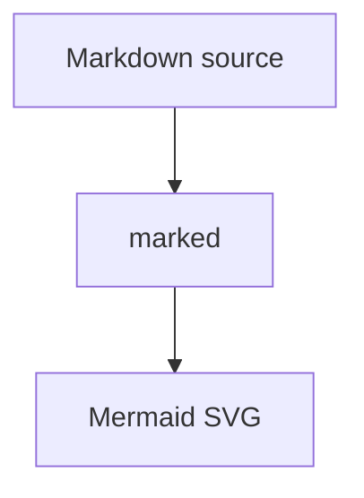

# doclive Markdown sample

This sample file is used for doclive preview QA.

- It contains a Mermaid fence.
- It contains inline math: $a^2 + b^2 = c^2$.
- It links to the Org fixture: [Org sample](sample.org#org-preview-fixture).

## Mermaid



## Copy Target

```emacs-lisp
(message "copy me from Markdown")
```

## Back Link

Open [sample.org](sample.org) to verify Markdown to Org navigation.
